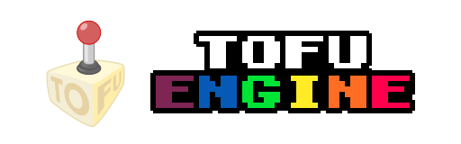

<p align="center">
    <a href="https://tofuengine.org"></a>
</p>

<p align="center">
    <a href="LICENSE.md"></a>
    
    <a href="https://mastodon.gamedev.place/@mode13h"></a>
</p>

<p align="center">
    <a href="https://github.com/tofuengine/tofu/tags"></a>
    <a href=""></a>
</p>

<p align="center">
    <!--  -->
    
    
    
</p>

# Introduction

Welcome to `Tofu Engine`!

Guess what? Yup, that's yet another game engine/framework.

## Highlights

* Carefully crafted C99 code.
* Self-contained, no additional runtime modules/libraries required (system-wide libraries excluded).
* Multi-platform support through cross-compilation (Windows, Linux, and [Raspberry-Pi](https://www.raspberrypi.org/) -- macOS currently not supported, possibly WebAssembly in the not-so-distant future).

For the courious ones, this is the current statistics of the game-engine codebase:

| Language       | Files  | Blank  | Comment  | Code   |
| -------------- | ------ | ------ | -------- | ------ |
| C              |    80  |  3348  |    2496  |  16777 |
| C/C++ Header   |    88  |   698  |    2408  |   2144 |
| Lua            |    22  |   296  |     497  |   1708 |
| GLSL           |    12  |   118  |     282  |    422 |
|                |   202  |  4460  |    5683  |  21051 |

## Features

* [x] Fully scripted in [Lua](https://www.lua.org/).
* [x] Straight multimedia support, no intermediate third-party libraries (OpenGL 2.1 required).
* [x] Windowed/fullscreen display with best-fit integer automatic scaling.
* [x] Array of predefined common/famous resolutions (e.g. C64, Capcom's arcades, Nintendo DS, Sony PSP, etc...).
* [x] Internal software renderer. OpenGL is used only to present the framebuffer to the user (and apply post-process effects).
* [x] Fixed- and variable-size *Blitter OBjects* drawing with rotation/scaling/flipping.
* [x] Support for both proportional and non-proportional bitmap-based fonts (alphabet subset can be specified, if required).
* [x] Sprite batching for optimized (ehm) batch drawing.
* [x] Tiles drawing with offset/scaling/flipping.
* [x] Palette-based graphics w/ 256 colors.
* [x] Predefined library of 8/16/32/64 colors palettes.
* [x] Banked palette support w/ color bias during VRAM transfer.
* [x] Automatic nearest-matching-color palette indexing of [RGBA8888](https://en.wikipedia.org/wiki/RGBA_color_model) images.
* [x] Per-color re-indexing (*shifting*) and transparency, affecting drawing operations (both per-draw and during VRAM transfer).
* [x] Multiple (offscreen) canvas w/ drawing state stack support.
* [x] SNES' Mode7-like transforms, with scanline based ([HDMA](https://wiki.superfamicom.org/grog's-guide-to-dma-and-hdma-on-the-snes)) changes.
* [x] Amiga's Copper-like programs, with pixel-wide resolution.
* [x] Image programmable copy functions, to implement *script-shaders*.
* [x] Image stencil copy function, with used definable *threshold function*.
* [x] Image blend copy, with user definable *blending function* (`repeat`, `add`, `sub`, `multiply`, `min`, `max`).
* [x] Post-effect display-wise fragment shaders.
* [x] Library of "retro-feel" post-effects (LCD, CRT, color-blindness, etc...).
* [x] Audio support w/real-time sound streaming on a separate thread.
* [x] On-the-fly audio mixing w/ per voice looping/panning/balance/gain/speed control.
* [x] Static and streamed audio data playback (FLAC format).
* [x] Module playback support (MOD, S3M, XM, and IT).
* [x] Out-of-the-box timers support.
* [x] Ready-to-use 2D vector class and higher-order iterators.
* [x] 2D physics-engine.
* [x] Customizable application icon.
* [x] Support for *archived games*, via custom "packed" format (w/ optional encryption). Multiple archives are supported, with root directory override.
* [x] Resource manager w/ caching I/O and single instance object loading/reuse.
* [x] Multiple player support w/ up to 4 simultaneous game controllers. Mouse emulation is supported. Controllers #0 and #1 can be keyboard emulated.
* [x] Screen capture and recording.
* [x] Framebuffer offsetting (e.g. for screen-shaking effect).
* [x] Out-of-the-box 'tweening functions support (optimized [Penner's](http://robertpenner.com/easing/) set).
* [x] Noise generators (Perlin, simple, and cellular).
* [x] Logging facility (w/ selectable severity level).
* [x] Run-time signature check for Lua's API functions (debug build). Also, UDTs are typed-checked with a custom [RTTI](https://en.wikipedia.org/wiki/Run-time_type_information) implementation.
* [x] Crash screen (debug build).
* [x] Game window focus detection (for game-pause).
* [x] Real-time performance statistics (FPS and frame times) and resource usage (memory).
* [x] User-dependent I/O functions to load/store game data.
* [x] Configuration override through command-line arguments.

## Dependencies

* [Chipmunk2D](https://chipmunk-physics.net/) v7.0.3
* [dr_libs](https://github.com/mackron/dr_libs) v0.12.42, v0.6.38, v0.13.13
* [FastNoiseLite](https://github.com/Auburn/FastNoiseLite) v1.0.1
* [Glad](https://github.com/Dav1dde/glad)
* [GLFW](https://www.glfw.org/) v3.3.9
* [libspng](https://libspng.org/) v0.7.4
* [libxmp](https://xmp.sourceforge.net/) v4.6.1
* [Lua](https://lua.org/) v5.4.6
* [miniaudio](https://github.com/dr-soft/miniaudio) v0.11.21
* [SDL_GameControllerDB](https://github.com/gabomdq/SDL_GameControllerDB)
* [spleen](https://github.com/fcambus/spleen) v1.9.3
* [Stefan Gustavson's noise library](https://github.com/stegu/perlin-noise.git)
* [stb](https://github.com/nothings/stb) libraries

## Inspirations

**#tofuengine** is an original software, result of the experience gained from ~30 years in programming on a broad range of platforms (some concept even stems back to *ancient* platforms like the [Amiga](https://en.wikipedia.org/wiki/Amiga) and the [SNES](https://en.wikipedia.org/wiki/Super_Nintendo_Entertainment_System), and *arcane* languages like [AMOS](https://en.wikipedia.org/wiki/AMOS_(programming_language)) and [Blitz BASIC 2](https://en.wikipedia.org/wiki/Blitz_BASIC)). However, it has also been influenced by modern similar/other software in one way or another. Here's a brief list.

* [Love2D](https://love2d.org/)
* [Pico-8](https://www.lexaloffle.com/pico-8.php)
* [picolove](https://github.com/picolove/picolove/)
* [Defold](https://defold.com/)
* [raylib](https://www.raylib.com/)

## Credits

The lovely game-engine logo has been designed by [Blort](https://social.tchncs.de/@Blort).

# Compiling

In order to compile `Tofu Engine`, a Linux machine in required (either physical or virtual). A Debian-based distribution is suggested, although I've been using Ubuntu during the development. One can issue the following commands to install all the required dependencies:

```bash
sudo apt install build-essential
sudo apt install mingw-w64

sudo apt install xorg-dev libx11-dev libwayland-dev libxkbcommon-dev wayland-protocols mesa-common-dev libgles2-mesa-dev

sudo apt install lua5.4 liblua5.4-dev luarocks

sudo luarocks --lua-version=5.4 install argparse
sudo luarocks --lua-version=5.4 install luafilesystem
sudo luarocks --lua-version=5.4 install luacheck
sudo luarocks --lua-version=5.4 install lua-hashings
```

Of course, `git` should also be installed to clone the repository.

```bash
sudo apt install git
```

Proceed in creating a local clone of the repository with the command

```bash
git clone https://github.com/tofuengine/tofu.git
```

into a suitable work directory. Move into the `tofu` directory you've just created and use `make` to build the executable. You can use the following command-line parameters to control the build process:

* `BUILD`, can be either `debug` or `release` with the usual meaning. If not specified, the build is assumed in **debug** mode.
* `PLATFORM`, can be `linux`, `windows`, or `rpi`. If not specified, the build is assumed for **Linux** platform. Please note that while the Windows build is generated on Linux using cross-compiling, the *Raspberry-Pi* build can be obtained only on a proper Raspberry-Pi board computer.
* `WINDOWING`, can be `x11`, `wayland`, `gdi`, or `mesa`. If not specified, the build assumes `gd1` for the **Windows** platform, `x11` otherwise. Please note that `mesa` is not really supported and `wayland` is experimental (but should work).
* `ARCHITECTURE`, can be either `x64` or `x32`. Please note that this is used only for the **Windows** build as the Linux one is 64-bit only, and the Raspberry-Pi is 32-bit only.

The build artifacts will be placed in the `build` directory.

> Alternatively, if you prefer not to tamper with your system, you can use a [Docker](https://docker.io) container for the build process. For that purpose, a ready-to-use *Dockerfile* can be found in the `extras/docker` directory. Use the `make docker-create` command to build the container and `make docker-launch` to start it in the current folder.

## Sample projects

Along with the game engine source, there are a bunch of (basic) demo projects. They are located in the `demos` sub-directory and can be launched using `make`, passing the name of the project as a target (e.g. `make splash`).

# Addenda

## Contributing

If **Tofu Engine** appeals you and

* you are experiencing some issue,
* you are seeing some unexpected behaviour,
* you have some cool ideas do you want to share, or
* you want to write some examples and/or documentation

please don't hold you back and [contribute!](CONTRIBUTING.md) :)

## Desiderata

### Core

* [ ] Boot splash-screen w/ resource preloading support (much like older consoles).
* [ ] On-screen overlay w/ performance information (FPS, graph, frame-time, etc...).
* [ ] Logging to file.
* [ ] Asynchronous resource loading/decoding with callback (maybe just some kind of pre-loading? With coroutines?)
* [ ] Webassembly build via [Emscripten](https://www.jamesfmackenzie.com/2019/12/01/webassembly-graphics-with-sdl/) to [HTML5](https://uncovergame.com/2015/01/21/porting-a-complete-c-game-engine-to-html5-through-emscripten/).
* [ ] Use a custom memory-management allocator.
* [ ] Multi-threaded parallel rendering (w/ double/triple buffering).
* [ ] Framebuffer rotations? Or does Mode7 suffices? But copperlists are not rendered on canvases...
* [ ] (Script-level) game state/screen transitions, something similar to the concept of "rooms" that many engines offer.
* [ ] Tweakable game-time management, to control the actual real-time game speed (speed up, slow down, pause, etc...)

### Graphics

* [ ] Switch to [Vulkan API](https://www.khronos.org/vulkan/) (through [GLFW](https://www.glfw.org/)).
* [ ] Animation support w/ frameset DSL (i.e. compiling a string where each token can be a single frame, a range or a "keep-current-frame for some time" command). Each frameset can have its one update period, and will be most likely based upon a timer.
* [ ] Tiled-map support w/ camera support (zoom and scrolling).
* [ ] Custom "raw" graphics and sound formats, with on-the-fly LZ4 (stream?) compression.

### Audio

* [ ] On-the-fly (could pre-cache it for later usage) sound synthesizer, similar to [srfx](https://github.com/grimfang4/sfxr).
* [ ] Audio channels support -- each source is to associated to a channel.
* [ ] Real-time audio effects (noise, reverb, filters, [spatialization](https://www.sfml-dev.org/tutorials/2.6/audio-spatialization.php), etc...).

### Input

* [ ] Better input handling by leveraging an event-driver approach -- this should reduce the current sub-system complexity ( as it polled).
* [ ] Rumble and force feedback support -- this might be implemented with a specific library as GLFW doesn't support it.
* [ ] Analogue support for shoulder and trigger axes.
* [ ] Apply filtering for the analogs, either with a low pass filter (page 591) or moving average.
* [ ] Implement buttons state check with XOR (page 594)
* [ ] chords and gestures detection, for example for Street Fighter II-like combos.

## Profiling

```bash
make bunnymark BUILD=profile
gprof ./tofu  gmon.out > analysys.txt
gprof ./tofu  gmon.out | ./extras/gprof2dot.py | dot -Tpng -o analysys.png
```
